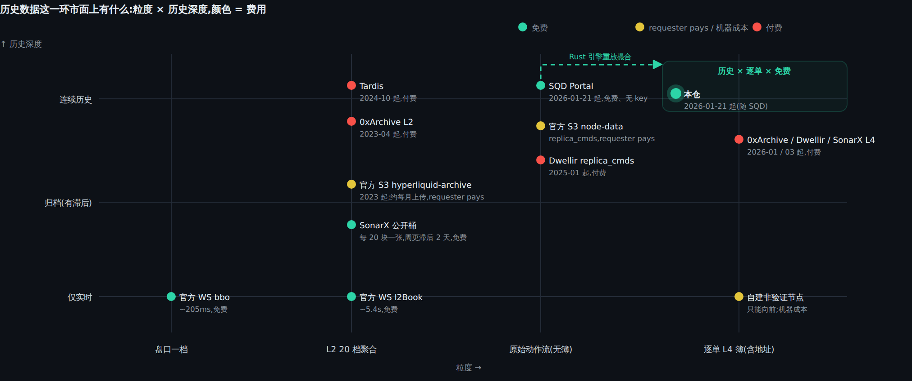
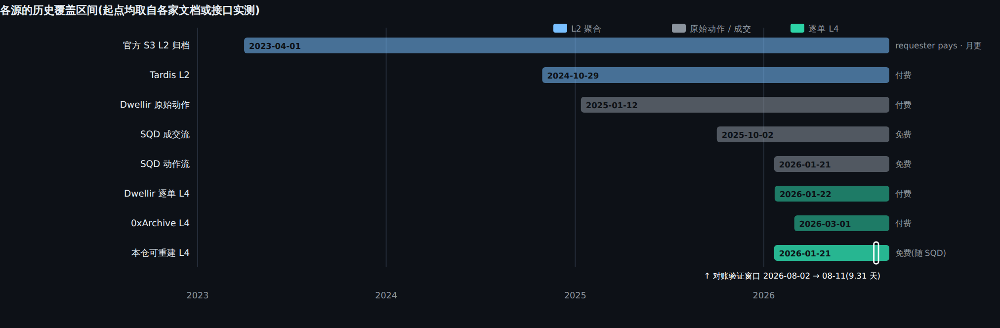
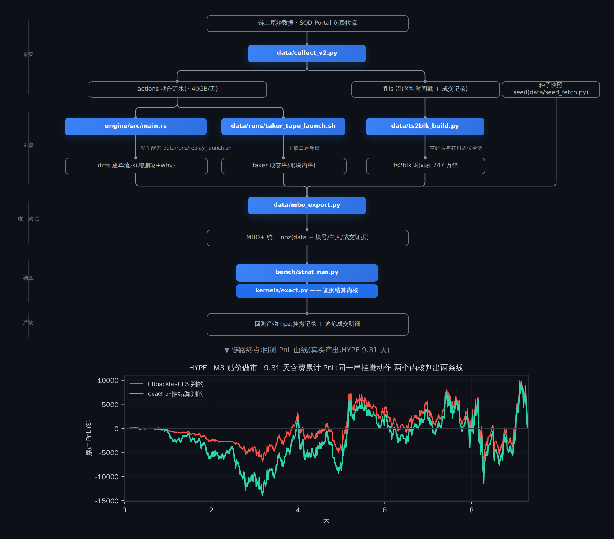
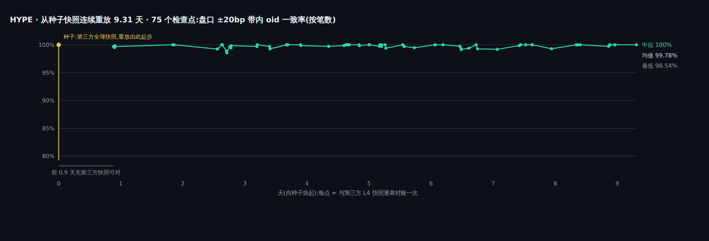
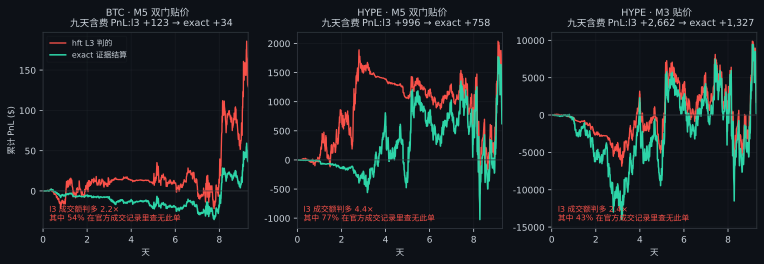

# hlstack

**Hyperliquid L4 订单簿:免费链上数据 重建 · 逐单对账 · 回测 · RL 环境**

门面网站(图文 + 交互链路图,每个节点可悬停): **https://n0moree.github.io/hlstack/**
License: MIT

> **EN** — hlstack rebuilds Hyperliquid's full L4 (order-level) book from free on-chain data with a Rust replay
> engine; reconciles it order-by-order against a paid commercial reconstruction (top-of-book ±20bp order-level
> agreement 99.8% mean / 100% median across 75 HYPE checkpoints, best bid/ask matching on all 341 snapshots, 99.9% of discrepancies attributed to a cause code); fixes hftbacktest's L3 fill semantics with an evidence-settled kernel —
> L3 over-fills makers by 1.33–8.8×, and 17–86% of its fills do not exist in the official trade record;
> and ships a gymnasium RL environment on the same settlement semantics. Docs are in Chinese;
> the [project site](https://n0moree.github.io/hlstack/) diagrams are self-explanatory.

## 一 · 这是什么

Hyperliquid 的撮合在链上执行,但官方从未公开撮合语义,市面也没有免费的逐单(L4)历史订单簿。
这个仓库把整条链修通:**拉取**链上原始动作流水(免费)→ Rust 引擎**逐块重放撮合**,重建出每张单的
价格/数量/队列位置/主人地址 → 逐单**对账认证**到第三方付费真值 → 统一成 MBO+ 格式做**回测**
(修正 hftbacktest 的 L3 成交语义)→ 顶上一个 gymnasium 标准的 **RL 环境**。

- **① 重建与正确性** Rust 引擎从免费链上动作流水逐块重放撮合,重建 oid 级(L4)订单簿(oid=交易所订单号);
  连续重放 9.31 天——与第三方付费重建的 L4 快照逐单对账,盘口 ±20bp 带内 oid 一致率均值 99.8%
  (HYPE,75 检查点,中位 100%)、341 张快照 BBO 全对,差异逐笔归因;官方 BBO 抽查 99.5% 一致。
- **② 修好的回测** hftbacktest 的 L3 语义在 HL 上有三处系统性偏差;
  `kernels/exact.py` 用官方成交记录当证据结算,回测显著更保守。
- **③ RL 环境** gymnasium 标准环境,按非验证节点的信息集与时序建模,成交判定固定为 exact;
  不附带训练结果——接你的 agent,用同口径的回测器评估。

## 二 · 数据链路:原始数据进,回测 PnL 曲线出

**现有数据的差距**——历史 L4 这一环,市面上只有"官方 L2(聚合、月更)"或"付费 L4(2026 年起)"两种货;免费的原始动作流一直在,没有人把它变成订单簿:



各家的历史起点(起点均取自各家文档或接口实测);免费的逐单重建从 SQD 动作流的起点开始可用:



五步把链上原始动作变成一条回测 PnL 曲线:采集 → 引擎重放 → 统一格式 → 结算 → 产物。每一步是一个仓内程序,输入输出都是落盘文件,任何一步都能单独重跑、单独对账。



自上而下 = 处理顺序,同一行 = 并列;蓝 = 仓内程序,灰 = 数据。
[项目主页](https://n0moree.github.io/hlstack/)上这张图每个节点都能悬停,浮出该程序的机制图或该份数据的真实样例行。

## 三 · 正确性验证:与付费重建的同一本订单簿逐单对账

用免费数据重建订单簿,再买来第三方(0xArchive)重建的同一本簿对答案:大体一致;
对不上的每一笔都点得出原因——其中一部分是免费数据里根本看不见的事件(如交易所静默删单),
消不掉,但讲得清楚。正确性不自证;第三方也不默认为对——两边冲突时,用交易所回执原文逐笔裁决。

以 HYPE 举例:种子是一张第三方全簿快照,引擎由它起步后连续重放 9.31 天、不再灌入任何快照;对账用的第三方快照按约 23 小时一格采购,第一格落在第 0.9 天,此前只重放不对账(BTC 另有一组密集快照,从第 0.04 天起共 181 张)。75 个检查点,每个与第三方 L4 快照逐单对账一次:



带内 oid 一致率:75 个检查点里 41 个为 100%,最低 98.54%,均值 99.78%;末态带内差异 0 笔。全簿口径(含离盘口 100bp 以外的深簿单)末态 97.0%,
差异中价格 / 方向 / 主人三字段 0 错,99.8% 的差异名义额在 50bp 以外;块末穿价修复前 22 块 → 0;前 20 档队列位置全对率中位 99.4%;
检查点台账 2,585 笔差异逐笔归因闭合,不可判 2 笔。

**引擎修正的四类语义**(官方未公开撮合语义,以下规则从回执文本和成交明细反推,每条是独立引擎开关,可单独关闭做消融):

| 类别 | 规则 | 效果 |
|---|---|---|
| 回执语义 | resting 回执意味着对侧此刻不存在可成交的单,价格越过它的对侧旧单据此删除;撤单 / 改单返回「不存在」意味着该单已被交易所删除(STP 等静默删除的唯一可见线索);成交后的剩余量按回执决定是否入簿 | 块末对账的主规则 |
| 块内顺序 | 成交明细没有块内顺序;以动作序号(actionIndex)作为块内时钟,决定删除规则的适用范围 | 穿价块 BTC 45→0、HYPE 22→0,终态账目不变 |
| modify 与 reduce-only | modify 会更换订单号,新旧号重新绑定;reduce-only 单在仓位归零后被交易所删除且无事件,用成交记录推断(同价同量重挂按替换处理,为启发式,单独标注) | 一个地址 4,467 张多余订单 → 5 张 |
| 块末一致性 | 块末检查未经回执确认的新单与被 taker 扫过的价位,清除与对侧最优价矛盾的单;已确认 resting 的单不动 | 只处理未确认的单 |

**数据源导致、无法消除的三类差异**:交易所静默删除(不产生事件、不进成交记录,如 STP;能从回执推断的已处理,其余不可观测);
起止两张第三方快照不一致的单(全程重放到第 9 天三币归零);官方成交记录的缺口(覆盖率 97.4–98.8%,按笔数;缺失部分 exact 不判成交,是保守偏差的来源之一)。

## 四 · 回测精度:L3 判的成交,17–86% 查无此单

把重建的簿喂给行业标准引擎 hftbacktest(L3),再用 exact 证据结算跑同样的策略:
l3 判给你的 maker 成交额恒判多 **1.33×~8.8×(20/20 格同向)**,其中 **17%~86% 在官方成交记录里查无此单**
(exact 同口径恒 0)。成交语义差三条,每一条 l3 都往「你更容易成交」的方向偏:

| hftbacktest L3 的语义 | HL 链上的真实语义 | exact 怎么补 |
|---|---|---|
| NoPartialFill:全成或不成 | 成交可以部分成交,残量留簿 | 逐笔部分成交,残量继续排队 |
| 到达穿价 → 立即按 taker 成交 | 撮合以块为粒度,块内按动作序执行 | 块纪律 + taker 序号(ai)块内定序 |
| 队列推进靠模型推断,不看真实成交 | 每笔成交在官方成交记录里有据可查 | 只判有证据的成交:零证据成交 ≡ 0 |



这三格是 20 格(4 币 × 5 策略)里 l3 判「赚钱」的全部格:每一格 exact 都判它少赚 24–72%。
亏钱的格里 l3 往往反而更亏——虚假成交是双向失真,唯一恒定的是成交量被判多。
逐格数字用 `bench/strat_run.py` + `bench/mbo_run.py` + `bench/judge_cmp.py` 现算;
仓内 sample 切片上一条命令即可就地复核"判多"(实测 3.0×,见 [sample/README.md](sample/README.md) 步骤 d)。

口径注:同一串挂撤动作喂两个内核是刻意的控制变量——比的是**成交判定**,不是策略;带库存反馈的
M4/M5/M6 在 l3 侧按 exact 仓位重放(开环),PnL 翻号的主张只在无状态的 M1/M3 上成立。
exact 是**证据下界口径**:对改善盘口、官方成交记录里无成交的价位判 0——不主张无偏,只主张不虚判。

## 五 · RL 环境:按非验证节点的信息集建模,接你的 agent

`shells/rl/env.py` 是 gymnasium 标准环境。仓库不附带任何训练结果;交付的是环境合同、参数依据,
以及一个与规则策略同口径的回测器——策略由使用者自带。

| 项 | 环境给什么 | 依据 |
|---|---|---|
| 可见信息 | 每个块 finalize 后全市场的挂/撤/改单原文、官方成交、回执、每张单的主人地址 | 数据源即 hl-node 非验证副本的输出(SQD replica-cmds) |
| 不可见 | mempool、共识前单流、块内中间状态 | 非验证节点同样看不见 |
| 决策时刻 | 块边界;块间隔实测 42–165ms,中位 68ms | sample/ts2blk.npz 现算 |
| 动作落地 | 默认 3 块(3 块间隔实测 152–356ms,中位 202ms);可调 | 外部 API 参与者发单到上链的典型区间 |
| 回执 / 观测延迟 | 默认 0;可调 | 同一套块计时 |
| 成交判定 | exact 证据结算(下界口径,见 §四) | 与 strat_run 同一内核 |
| 不建模 | 自身订单对市场的反作用 | 回放式回测的共同边界 |

```bash
python shells/rl/examples/plug_in.py sample/mbo_SOL.npz                                  # 接入示例:任意 act(obs)->action
python shells/rl/examples/rollout.py SOL sample/mbo_SOL.npz out.npz --policy hold        # 回测器自检:不动策略 PnL 恒为 0
python shells/rl/examples/rollout.py SOL sample/mbo_SOL.npz out.npz --policy 你的模块:policy   # 单集整窗回测,产物与 strat_run 同口径
```

`rollout.py` 接受任何 `act(obs)->action` 可调用对象或带 `predict()` 的 stable-baselines3 模型,整窗单集滚动、
不切集、不清仓,输出 f_/PnL 数组,可直接与 §四 的规则策略同表比较。合同测试在 `tests/test_rl_env.py`
(gymnasium `check_env`、同 seed 同轨迹、延迟生效、随机动作下观测有限、整窗单集不变量)。

## 六 · 快速开始

```bash
git clone https://github.com/N0MOREE/hlstack.git && cd hlstack
uv venv && uv pip install -e '.[dev]'         # 核心 + pytest(产品线零 hftbacktest 依赖)
pytest tests/ -q                              # RL 测试需 .[rl],未装时跳过
uv pip install -e '.[bench,rl]'               # 跑 §四 对照 / RL 才需要(hftbacktest+numba / gymnasium)
pytest tests/ -q                              # RL 环境合同测试用仓内 sample 数据,任何机器可跑满
cd engine && cargo build --release && cd ..   # 重放引擎(Rust,约 10 秒干净编译)
```

五分钟跑通:重放 → 对账 → 回测 → RL(仓内自带 5.8MB SOL 切片,含种子 + 真值快照):

```bash
python sample/check_replay.py          # 重放 31.9 分钟行情 → 逐 oid 对账:一致率 99.64%(窗口内被触达单;总体口径 99.97%),±20bp 带内差异 0

HL_FACTS=sample python data/mbo_export.py SOL sample/my_mbo.npz --b0 1105427875 --b1 1105454875 \
    --diffs sample/diffs_SOL.ndjson.gz --ts2blk sample/ts2blk.npz --seed sample/seed_SOL.json \
    --tape sample/tape_SOL.ndjson.gz --fills sample/fills_SOL.ndjson.gz
python bench/strat_run.py run SOL sample/my_mbo.npz sample/my_strat.npz --params sample/abc_params.json
python shells/rl/examples/rollout.py SOL sample/mbo_SOL.npz out.npz --policy hold   # RL 回测器自检:PnL 恒为 0
```

数据从零重建(SQD 拉流 / 种子快照 / 全程重放 / MBO+ 导出):

```bash
python data/collect_v2.py actions --from <块号> --to <块号>   # SQD 免费拉流,无 key(fills 同款)
python data/seed_fetch.py SOL <毫秒时刻> seed_SOL.json        # 0x 种子快照(需自备 key,1 credit)
./data/runs/replay_launch.sh                                  # Rust 引擎重放出逐单流水(交付配方)
python data/mbo_export.py BTC mbo_BTC.npz                     # 流水 → MBO+ 统一文件
```

```text
engine/    重放引擎(Rust;12 个语义机制开关,见 data/runs/replay_launch.sh)
data/      采集(collect_v2)· 流水→MBO+(mbo_export)· 时间表(ts2blk_build)· 种子(seed_fetch)· 交付配方(runs/)
kernels/   结算内核:exact(证据结算)· l3(hftbacktest 封装)· book(共用逐单簿)
bench/     strat_run(五策略)· mbo_run/judge_cmp(l3 对比)· ledger_bt/exact_parity(全等门)· mbo_check(MBO+ 导出对拍)· micro(0x 对账)
shells/    策略壳 hlbt · RL 环境 HlEnv(+ rollout / plug_in)
sample/    SOL 切片样例数据包(5.8MB,三步跑通全链)
docs/      index.html(项目主页)
tests/     纯逻辑测试(pytest)
```

---

原始验收数据不随仓分发,数字以 sample 包复现为准(sample 切片 + 上表口径)。
仓内全部数据均为链上公开信息的再分发(SQD Portal 原始流水的重放产物 + 0xArchive 快照;挂单地址为链上公开数据),不含任何非公开信息。
